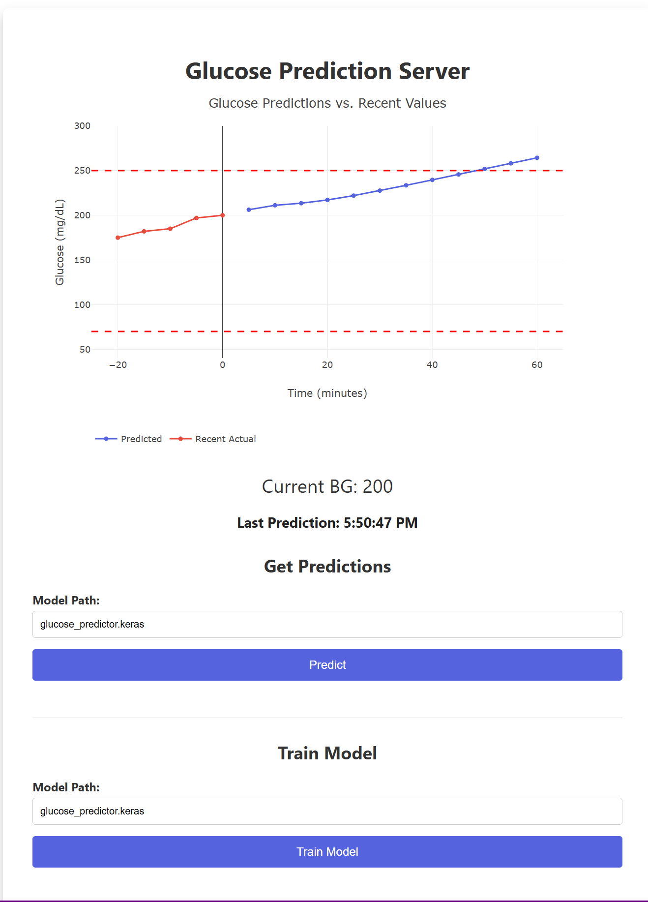

# Glucose Prediction Project

This project is a machine learning system for predicting future glucose values from Nightscout data. It leverages an LSTM neural network built with TensorFlow and uses additional tools such as NumPy, scikit-learn, and Plotly to process data, train the model, and visualize predictions. It offers CLI or web interface.

## Prerequisites
- The BGPredictor expects you to be an existing Nightscout user with a working instance of Nightscout available. In that case, you likely also have data stored in MongoDB using the Nightscout schema, which is helpful when training a new model.
- This project utilizes TensorFlow but does not require a GPU. In fact, GPU support is broken on the initial release. Generating predictions takes a few seconds on a midrange CPU and training takes minutes.
- This project can be built using Docker, which you may need to install first.

## Features

- **Data Retrieval**: Downloads glucose (SGV) data from a Nightscout site or directly from MongoDB. Direct download of data from MongoDB allows for a much larger training set (and therefore better results).
- **Model Training**: Prepares data sequences using features including the glucose value, day of week, day of month, and time of day and then trains an LSTM model to predict future glucose values.
- **Prediction**: Predicts the next 12 time steps of glucose data (1 hour of 5-minute intervals). Plots values for visualization using Plotly.
- **Web Interface**: Provides a simple web interface that can be used to get new predictions or train a model
- **Console Interface**: A command line interface can be used instead.
- **Performance Evaluation**: After training a new model, this software generates an HTML report with scatter plots comparing predicted and actual values and a plot displaying the mean absolute error (MAE) over time.



## Installation

### Local Machine

1. **Clone the repository**:

   ```bash
   git clone https://github.com/DiscoTex/BGPredictor.git
   cd BGPredictor
   ```

2. **Install dependencies**:

   ```bash
   pip install -r requirements.txt
   ```

3. **Configure Environment Variables**:  
   Rename the `.env.sample` file to `.env`
   Modify `.env` file in the project root with your own Nightscout URL and MongoDB connection string

   ```
   NIGHTSCOUT_URL=https://your-nightscout-url.com
   MONGODB_URL=your_mongodb_connection_string  # Optional, only if using MongoDB
   MODEL_NAME=glucose_predictor
   ```

4. **Run the Server**
   - To start the Flask web server:

     ```bash
     python server.py
     ```

     Then open your browser at [http://localhost:5000](http://localhost:5000).

5. **OR, Run the tool from the command line**
   (see below)


### Docker Installation

1. **Clone the repository**

   ```bash
   git clone https://github.com/DiscoTex/BGPredictor.git
   cd BGPredictor
   ```

2. **Build the Docker Image**

   Open a terminal in the project directory (where the Dockerfile is located) and run:

   ```bash
   docker build -t glucose-prediction .
   ```

3. **Run the Docker Container**

   To run the container and map port 5000 (default Flask port) to your local machine, execute:

   ```bash
   docker run -p 5000:5000 glucose-prediction
   ```

4. **Access the Application**

   Open your browser and navigate to [http://localhost:5000](http://localhost:5000) to view the web interface.

## Usage

### Command-Line Interface (CLI)

- **For Predictions:**  
  This command loads an existing model and makes predictions based on recent Nightscout data (the most recent 500 entries)
  
  ```bash
  python predict2.py --url YOUR_NIGHTSCOUT_URL
  ```

- **For Training the Model:**  
  Use the `--retrain` flag to force training a new model (with an optional MongoDB URL). This will use a larger dataset (5000 entries if MongoDB is provided, otherwise about 1000 from Nightscout). Training will overwrite the existing `glucose_predictor.keras` model file by default.
  
  ```bash
  python predict2.py --url YOUR_NIGHTSCOUT_URL [--mongo YOUR_MONGODB_URL] --retrain
  ```

### Web Interface Workflow

**Using the Web UI:**  
     
- **Request Predictions:**  
     Upon loading the web interface, the software will download 500 entries of recent Nightscout data, load an existing model specified in the .env, and predict the next 12 time steps (1 hour in 5-minute intervals). The predicted glucose values, along with the most recent 5 historical entries, will be displayed in a plot.
     
- **Train a New Model:**  
     If you need to retrain the model, use the retraining option in the web UI.  
     - Provide a new model name in the form if desired (or leave it blank to use the default).  
     - The application will fetch data (from MongoDB if available or from Nightscout otherwise), retrain an LSTM model, and then display an HTML report of model performance. This repo includes a default model, which can work for testing purposes, but you should train a new one based on your own data.
     
- **Review Model Performance:**  
   After training, the system generates and displays a detailed HTML report. This report includes scatter plots comparing the predicted and actual glucose values and a plot showing the Mean Absolute Error (MAE) over the prediction time steps.

## Contributing

Feel free to open issues or submit pull requests to enhance the functionality of this project.

## License

This project is licensed under the MIT License. See the [LICENSE](license.txt) file for details.